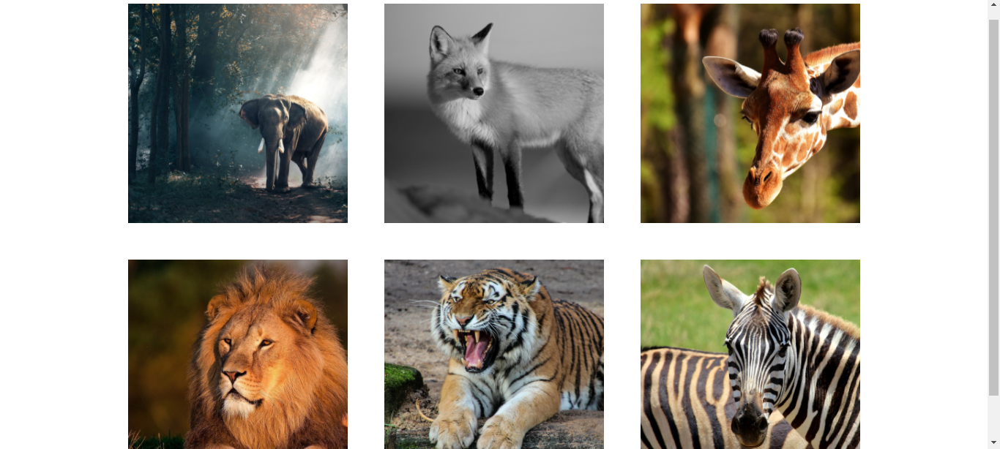
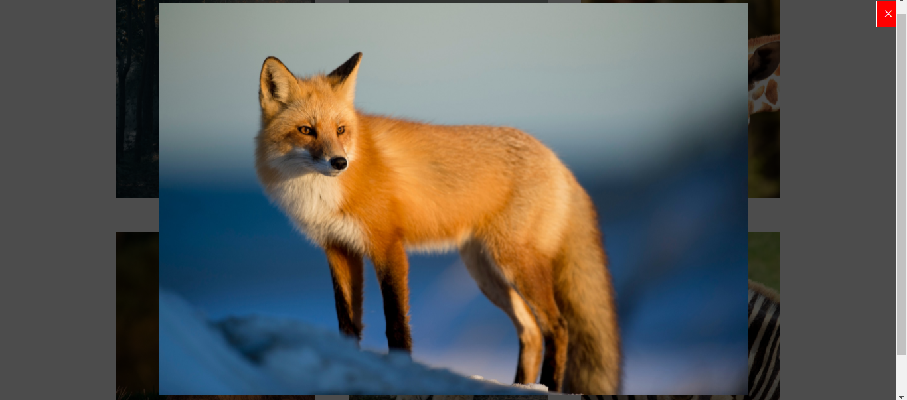

# Galeria de Imagens Modal - Responsiva

### Tecnologias Utilizadas

O projeto foi desenvolvido com:

- [x] Criação do HTML
- [x] Criação do CSS
- [x] Criação do JAVASCRIPT

## 🤝 Colaboradores

Agradecemos às seguintes pessoas que contribuíram para este projeto:

<table>
  <tr>
    <td align="center">
      <a href="https://www.linkedin.com/in/camila-benetasso/">
         
        
          <b>Camila Benetasso</b>
        
      </a>
    </td>
        
      </a>
    </td>
  </tr>
</table>

### Imagens do Projeto

  

> Projeto feito em aula para desenvolvimento e aprimoramento das tecnologias utilizadas nele. Nesse projeto você terá a possibilidade de ter uma galeria que ao clicar na imagem você possa ter uma animação deixando a imagem em branco e preto antes de abri-la.

[⬆ Voltar ao topo](#nome-do-projeto) 

 

 
